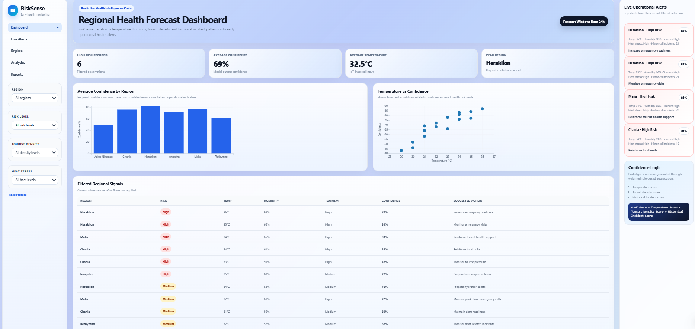

## RiskSense:Interactive Analytics Dashboard for Early Regional Health Monitoring

## 📌 Overview

RiskSense is an experimental analytics tool which utilizes environmental and contextual factors together to create one Dashboard that can be used for early health monitoring.

RiskSense creates a Dashboard which combines various weak indicators (such as temperature, humidity, number of tourists, etc.) into one score using a confidence measure.

---

## 🎯 Objective

- Provide an early warning system to identify health risks in the region.
- Offer transparent analytics (not black-box systems).
- Dashboards help in decision-making.
- Demonstrate a proposed approach for multisignal health risk prediction.

---

🧠 Approach

The proposed system employs the following weighted aggregation formula:

Confidence = w_T * T_s + w_D * D_s + w_H * H_s

Where:- T_s: Temperature Score
- D_s: Tourist density score
- H_s: Historical incidents score.# 📉 Dashboard

The RiskSense dashboard presents a graphical interface for analyzing regional data.

---

### 🖼️ Dashboard Preview

The dashboard visualizes how multiple weak signals are combined into a unified confidence score.

# 🗂️ Data

### Environment
- Temperature  
- Humidity

### Region 
- Tourist Density 
- Incidents in the past

### Output
- Confidence score
- Risk level 
- Suggested actions

## 🧩 System Structure
Inputs –> Processing –> Confidence Logic –> Dashboard 
## 💻 Technologies 
- JavaScript 
- D3.js 
- dc.js
- Crossfilter

---
